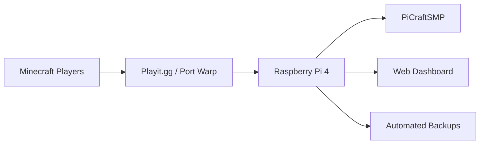
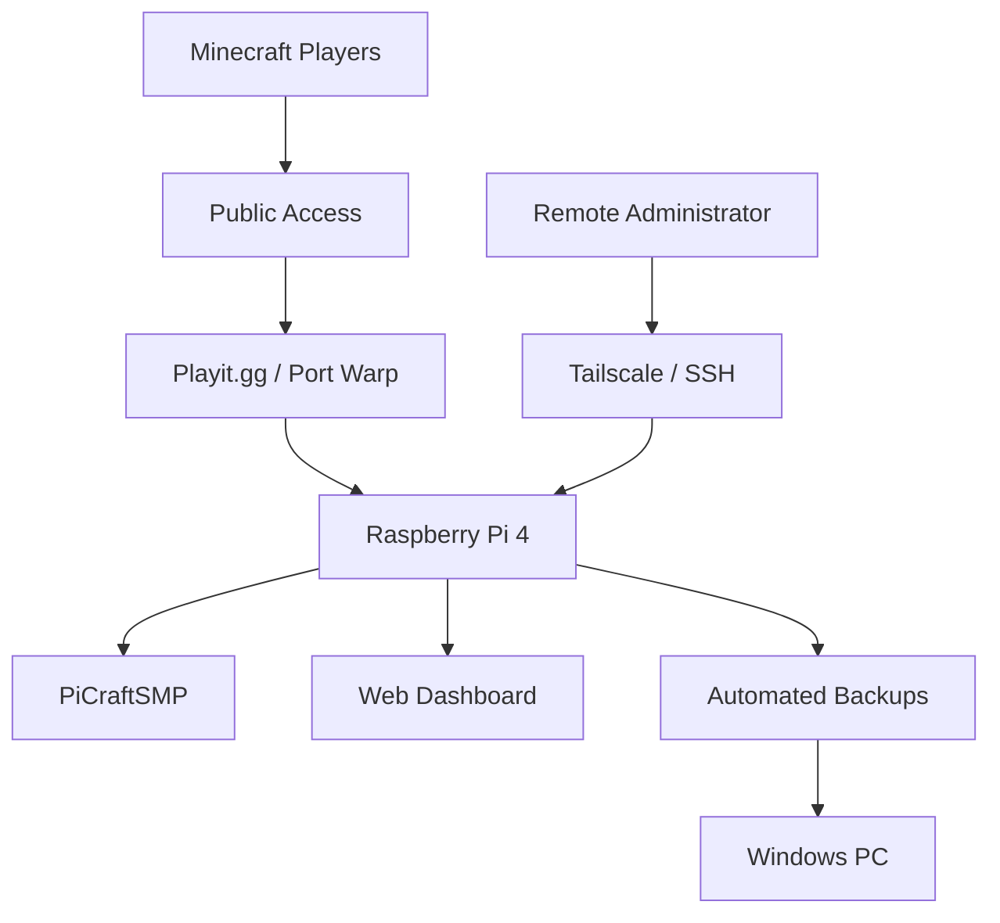

# PiCraftSMP 🎮

A 24/7 Minecraft Java server hosted on a Raspberry Pi 4, with remote access, monitoring, automated backups, and a custom web dashboard.

## Features

- 24/7 Minecraft Java server
- Hosted on a Raspberry Pi 4 with 8 GB RAM
- Remote access using Playit.gg and Port Warp
- Custom web-based monitoring dashboard
- Live player and server status monitoring
- Raspberry Pi temperature and system monitoring
- Remote server administration
- Automated backups every 48 hours
- 14-day backup retention
- Backups automatically synced to a Windows PC
- SSH-based remote management
- Tailscale private network access

## How It Works

Players can connect remotely to PiCraftSMP while the Minecraft server runs continuously on the Raspberry Pi.

## Hardware

| Hardware | Specification |
|---|---|
| Server | Raspberry Pi 4 |
| RAM | 8 GB |
| Architecture | ARM64 / aarch64 |
| Cooling | Active cooling |
| Network | Ethernet / Wi-Fi |
| Backup device | Windows PC |
| Storge | 32GB Micro SD card |

## Software

| Software | Purpose |
|---|---|
| Raspberry Pi OS | Server operating system |
| Java | Runs the Minecraft server |
| Minecraft Java Server | PiCraftSMP game server |
| Playit.gg | Public Minecraft access |
| Port Warp | Additional server connectivity |
| Tailscale | Private remote access |
| SSH | Remote server administration |
| Custom Web Dashboard | Monitoring and server control |
| Bash | Server and backup automation |
| Windows PowerShell | PC-side backup automation |

## Networking & Remote Access

PiCraftSMP is designed to be accessible remotely while keeping server administration separate from normal player access.

### Playit.gg

Playit.gg provides public Minecraft access without requiring traditional router port forwarding. Players can connect to the server without installing additional networking software.

### Port Warp

Port Warp provides an additional method of connecting to the Minecraft server.

### Tailscale

Tailscale provides private remote access to the Raspberry Pi for server administration.

This allows the Raspberry Pi to be securely accessed from other authorized devices without exposing administrative services directly to the public Internet.

### SSH

SSH is used to remotely manage the Raspberry Pi, including:

- Starting and stopping the Minecraft server
- Checking server status
- Managing server files
- Running backups
- Monitoring the Raspberry Pi

## Web Dashboard

A custom web dashboard provides an easy way to monitor and control PiCraftSMP.

The dashboard includes:

- Server online/offline status
- Connected players
- Server uptime
- Network latency
- Raspberry Pi system information
- Server controls
- Console access

## Automated Backups

PiCraftSMP uses an automated backup system to protect the Minecraft world and server data.

- Backups are created every 48 hours
- Backups are timestamped
- Backups are retained for 14 days
- Backups can be copied to a Windows PC
- SSH key authentication allows automated transfers

This provides both local and off-device copies of important server data.

## Server Architecture

## Screenshots

## What I Learned

Building PiCraftSMP provided practical experience with:

- Linux server administration
- Raspberry Pi hardware
- Computer networking
- Network tunneling and remote access
- SSH and key-based authentication
- Bash scripting
- PowerShell
- Automated backup systems
- Web-based server monitoring
- Minecraft server administration

## Security

Sensitive information such as SSH private keys, authentication tokens, tunnel credentials, IP addresses, and other secrets are not included in this repository.
